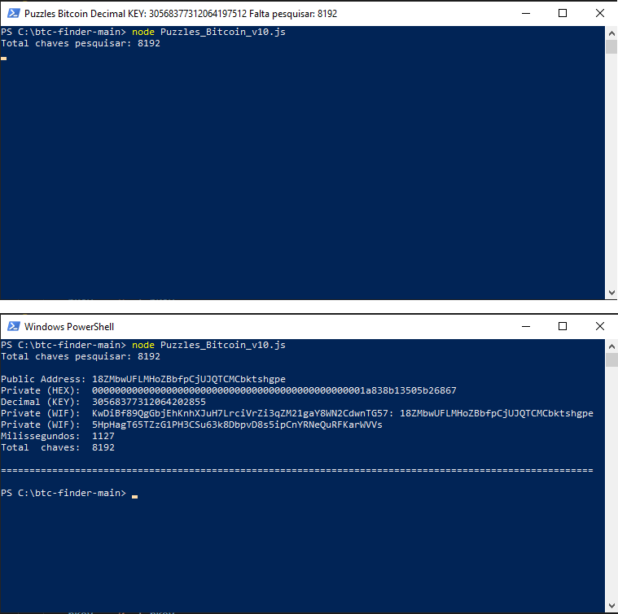
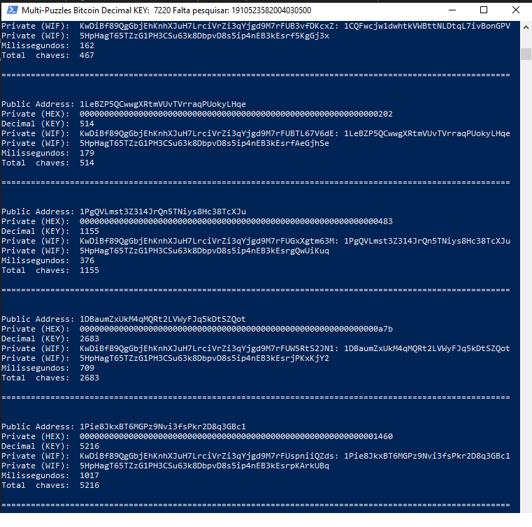

# Instruções

DOAÇÕES
PIX - CPF 032.998.869-75
Odemar Ribeiro Junior

`Linha 12`
const min = 0x20000000000000000  // => Alterar aqui 66 bits

`Linha 13`
const max = 0x3ffffffffffffffff  // => Alterar aqui

`Linha 16`
const wallets = ['13zb1hQbWVsc2S7ZTZnP2G4undNNpdh5so'] // => Alterar aqui

alterar arquivo na pasta puzzles.txt // => Alterar aqui

linux:

`$ npm install`
`$ node Puzzles_Bitcoin_v10.js`
`$ node Multi-Puzzles_Bitcoin_v10.js`

Windows PowerShell: 

`npm install`
`node Puzzles_Bitcoin_v10.js`
`node Multi-Puzzles_Bitcoin_v10.js`

